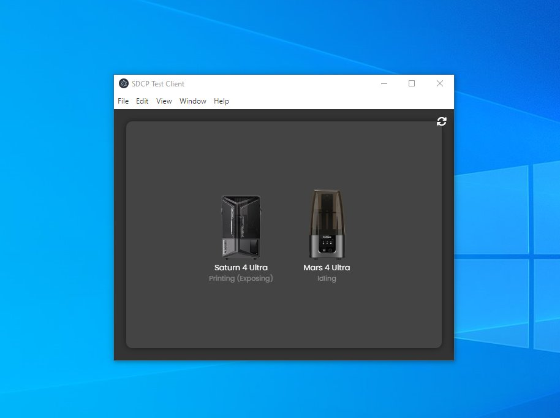

# SDCP example client

### Print monitor test app
A very small (very crude) Electron test client for my [SDCP NodeJS module](https://www.npmjs.com/package/sdcp). 



It is not pretty (does not sandbox) but it's purely to test features and demonstrate how the codebase works.

### Installation & running
```
git clone https://github.com/blakejrobinson/sdcp_testclient/
cd sdcp_testclient
npm i
npm run start
```

Once running, press the refresh icon (top right) to discover printers on the network.

Hover the mouse over a printer for options.

### Features

- Discovery, address book and printer status monitoring,
- File uploading,
- Camera capture (V3.0.0),
- File browsing (V3.0.0),
- Start printing from browser (V3.0.0)
